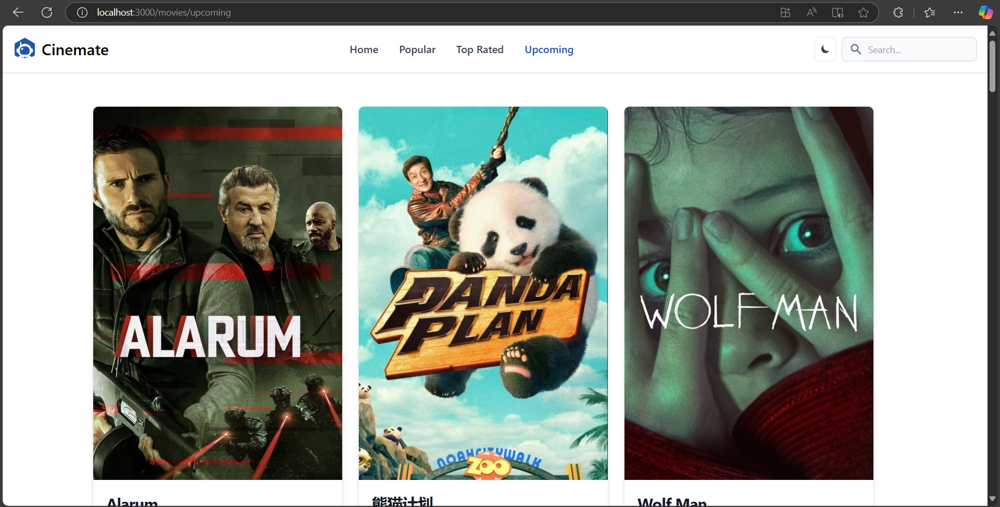
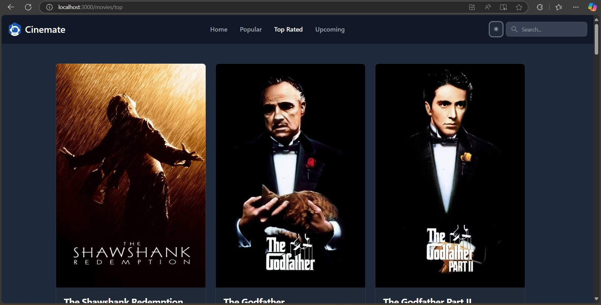

# Project Title

## Description
A brief description of the project, its purpose, and functionality.

## Installation Instructions
1. Clone the repository:
   ```bash
   git clone <repository-url>
   ```
2. Navigate to the project directory:
   ```bash
   cd <project-directory>
   ```
3. Install the necessary dependencies:
   ```bash
   npm install
   ```

## Usage Instructions
1. Start the development server:
   ```bash
   npm start
   ```
2. Open your browser and navigate to `http://localhost:3000`.

## Screenshots



## License
This project is licensed under the MIT License - see the [LICENSE](LICENSE) file for details.
